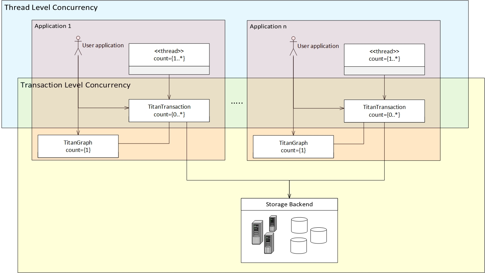
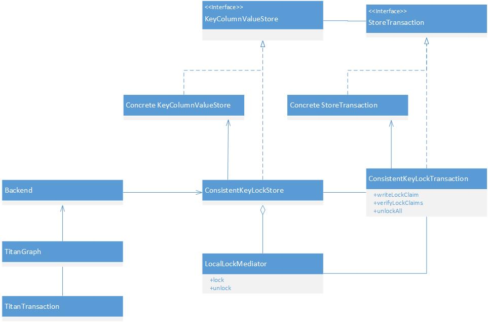
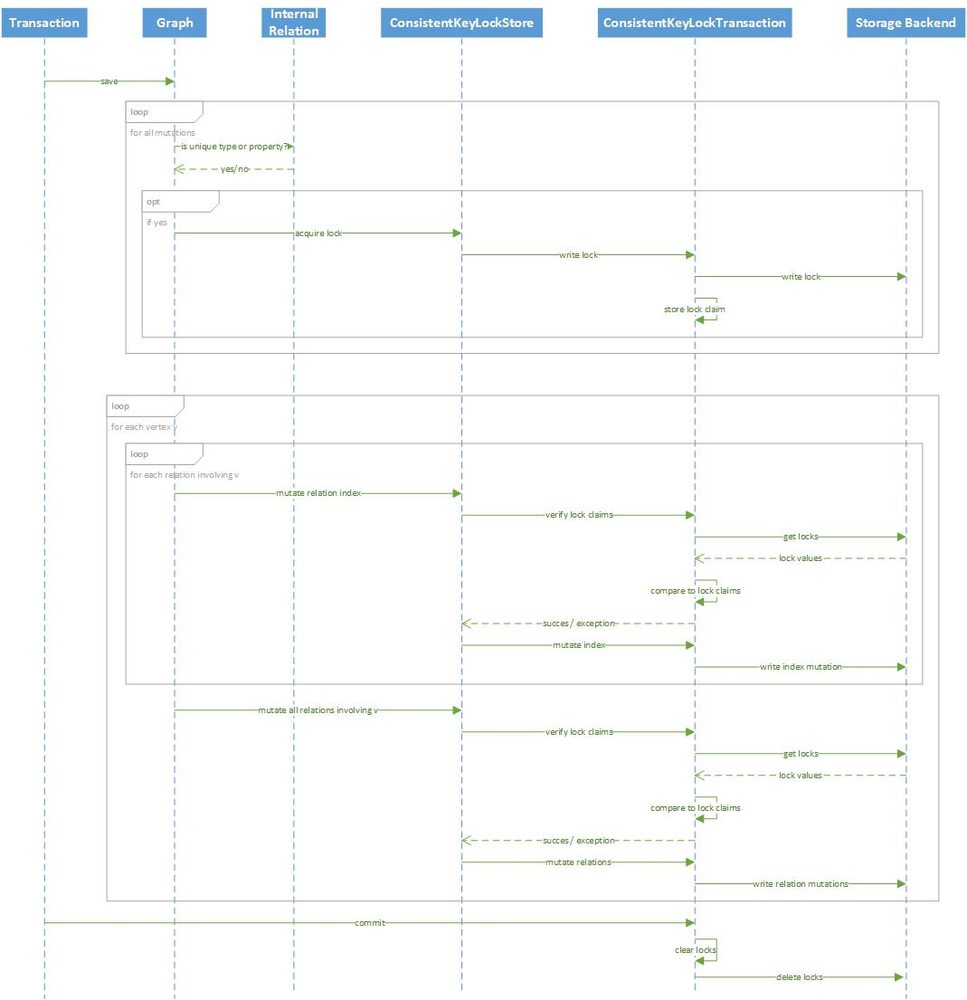

# Concurrency in Titan

Titan states in their [introduction](http://thinkaurelius.github.io/titan/) that it is a *highly scalable* graph database that supports *thousands of concurrent users*. This shows that the Titan regards scalability and concurrency as two key values of the Titan graph database. 

Titan ensures scalability mainly through the [indexing](https://github.com/thinkaurelius/titan/wiki/Indexing-Backend-Overview) and [storage](https://github.com/thinkaurelius/titan/wiki/Storage-Backend-Overview) backends that are used in conjunction with Titan. Concurrency in Titan may be identified at two different levels: Firstly, because Titan is a transactional database, Titan allows for thousands of concurrent users through [transaction handling](https://github.com/thinkaurelius/titan/wiki/Transaction-Handling). Secondly, Titan also allows for [multiple threads](https://github.com/thinkaurelius/titan/wiki/Multi-Threaded-Transactions) to work on single local transaction. In this document we will document the concurrency mechanisms at both levels, taking the concurrency viewpoint as described by Rozansky and Woods as a guideline. The image below provides an overview and indicates the two concurrency levels in Titan. Each Transaction runs in its own thread (or multiple threads). Multiple Transactions are open simultaneously, some may exist within the same process, and some may run on remote processes.

How simultaneous commits from multiple transactions are handled by the storage backend is not the respsonsibility of Titan. How this is to be dealt with is forwarded to the actual storage backend that is used. This section will therefore discuss for a how Titan ensures that certain properties of the Graph model are not violated by concurrency.

## Locking Unique Types

Edge labels and Property types in Titan may be defined to be unique. A type is unique, if there is at most one edge or property of this type per vertex in the given direction. More information on unique types may be found on the [Titan wiki]((https://github.com/thinkaurelius/titan/wiki/Type-Definition-Overview).

In order to guarantee uniqueness of Types, Titan uses locking of specific ``<Key, Column>`` pairs at three different occasions:

* At Thread level to guarantee uniqueness within a Transaction that is worked on by multiple threads
* At Transactional level within a process to guarantee uniqueness between local transactions
* At Backend level to guarantee uniqueness between remote transactions

As confirmed by Matthias, one of the [main developers](https://github.com/delftswa/ReportingRepo/blob/aurelius-titan-developmentview/aurelius-titan/Stakeholders.md#developers), in [this topic](https://groups.google.com/forum/#!topic/aureliusgraphs/X2BOJkShwFI), locks are only used for guaranteeing uniqueness of types. Though it can be chosen to ignore locking to improve performance, we will logically assume in this document that locking is enabled.

## Multiple Open Transactions on the Backend

In order for the ID manager to guarantee proper id allocations (TODO: link Jan), the storage backend needs to support either consistent key or transactional operations. For transactional storage backends locks are implicitly held. Such storage backends are wrapped by the ``TransactionalLockStore`` storage backend, which does nothing when a transaction attempts to acquire a lock. 

Storage backends that support consistent key operations (this holds for Cassandra and HBase) are wrapped by the ``ConsistentKeyLockStore`` class that wraps and adds locking support to the ``KeyColumnValueStore`` storage backend by overriding the ``acquireLock`` method to allow acquisition of locks, The ``mutate`` method which does the actual writing to the storage backend is also overwritten such that it first verifies all lock claims before writing. The wrapped KeyColumnValueStore will be referred to as the ``Data Store``. An additional ``KeyColumnValueStore`` is used for storing locks, we will refer to this as the ``Lock Store``. An overview of the imposed structure is shown in the following image. Note that the ``ConsistentKeyLockStore`` uses the two concrete implementations of the ``KeyColumnValueStore`` mentioned above, one for locks and one for the graph data.

The following sequence diagriam displays a simplification of the process of committing the set of mutations to the Titan Graph that are contained by a transaction. A more accurate sequence diagram can be found [here](diagrams/graphsave.jpg) that corresponds better to the actual classes that participate in the process. The ``Backend`` shown in the diagram is accessed through the concrete implementations of the KeyColumnValueStore that are wrapped. [This diagram](diagrams/graphandtransactions.jpg) gives an overview of the different Backends and Transactions surrounding the Titan Graph. Which actual concrete implementations are used is defined in the configuration when creating the graph.

The main remark for this diagram is that it does not distinguish between properties and actual relations. Depending on whether the considered edge is a relation or a property, the ``ConsistentLockStore`` and ``ConsistentKeyLockTransaction`` wrap either the ``KeyColumnValueStore`` and ``StoreTransaction`` that belong to the ``edgeStore`` or ``vertexIndexStore`` respectively. (TODO: link Jan voor meer info)

A second remark is that the entire save process in for the ``Graph`` is repeated a configurable amount of times with a configurable amount of waiting time in between the attempts. More information on these configuration options can be found [here](https://github.com/thinkaurelius/titan/wiki/Graph-Configuration) under parameters *storage.write-attempts* and *storage.attempt-wait*.

### Locking, Verifying Locks and Unlocking

The three subprocesses for writing, verifying and unlocking locks in the diagram above are particularly interesting and important for the concurrency within Titan. Because of this we will discuss in more detail how these methods work. None of the current backend adapters facilitate locking, so we will discuss the locking mechanisms as provided by the ``ConsistentKeyLockStore`` and ``ConsistentKeyLockTransaction`` wrappers provided by Titan itself.

A ``LockClaim`` can be placed on a certain ``<Key, Column>`` pair, and is identified by a 'Requestor Id (rid)' that is unique to each process and a timestamp. Additionally the value that the process expects for the ``<Key, Column>`` pair must be provided. Locks expire after a configurable amount of time.

#### Writing a Lock

When writing a lock, the ``ConsistentKeyTransaction`` first verifies whether the lock is not already held in the list of claimed Locks. This ensures consistency at Thread level.

Next, it attempts to acquire a lock with the ``LocalLockMediator``. Because all Transactions that run within the same process identify their external locks with the same rid, this is a necessary step to guarantee consistency within the local process. When no other local transaction has already locked the same <Key, Column> pair this is succesful, otherwise an exception is thrown and the Lock fails instantly. This step guarantees consistency between Transactions within a local process.

Finally, the Lock is written to the ``Lock Store`` as a ``<Key, Column>`` where the Key uniquely identifies the ``<Key, Column>`` that is being locked, and the Column describes the rid and timestamp of the locking process. The write must be succesful within a configurable amount of time. When the write is succesful, the expiration time is logged and the Lock is added to the list of claimed Locks. If at any point the writing of the Lock fails, the process will retry for a configurable amount of times to write the Lock. If after this number of retries the Lock still could not be written, the lock is removed from the ``LocalLockMediator`` and the Locking fails. This step attempts to ensure concurrency between remote Transactions.

For external Locks there is no guarantee that no other process has not already locked the corresponding ``<Key, Column>`` pair, because this verification would affect performance too much. If this is the case, it will be identified during the verification of the Lock.

#### Verifying a Lock

In order to verify a lock claim ``ConsistentKeyTransaction`` retrieves all lock claims for the corresponding ``<Key, Column>`` from the ``Lock Store``. All lock claims that have expired will be ignored, and for all remaining lock claims it is determined which process (identified by rid) placed the lock claim with the earliest timestamp. If the local rid corresponds to the rid of the process that has the earliest lock claim, the lock claim holds.

As a second check it is validaded whether the expected value as stated in the lock claim corresponds to the current value of the ``<Key, Column>`` pair as stored in the ``Data Store``. The current value is retrieved from the ``Data Store`` and compared to the expected value. If this matches, the lock is fully valid, if not, an exception is thrown and the lock claim has failed.

#### Removing a Lock

In order to remove a Lock, the lock claim is removed from the list of active lock claims maintained by the ``LocalLockMediator``. Additionally, the Column that describes the process rid and timestamp for the time of requesting is removed from the ``Lock Store`` for the row corresponding to the Key that is corresponds to the ``<Key, Column>`` for which the lock is requested.

## Multi-Threaded Transactions

As stated above, Titan allows for [multiple threads](https://github.com/thinkaurelius/titan/wiki/Multi-Threaded-Transactions) to work on a single transaction. Many graph algorithms can be parallelized for improved performance. In order to allow for correct multi-threading, certain caches within the transaction have to be adapted to deal with concurrency and a locking mechanism is required to guarantee uniqueness of relations between threads.

### Concurrent Cache Data Structures

Titan uses caches within a transaction for storing vertices, types, relations and vertex indices that have been added in the scope of the transaction, and that have therefore not yet been persisted to the storage backend. Whenever a query on the graph is performed, the information from these caches is integrated with the data from the storage backend for completeness. 

When multi-threading is enabled in the configuration, the data structures used for these caches are replaced by their Concurrent versions. For example the ``SimpleVertexCache`` is replaced by the ``ConcurrentVertexCache`` which uses [reentrant locks](http://docs.oracle.com/javase/6/docs/api/java/util/concurrent/locks/ReentrantLock.html) for restricting access to the critical read and write methods of these caches. Where possible, standard Java concurrent data structures are used. For example the ``HashMap`` used for the type cache is replaced by the [``ConcurrentHashMap``](http://docs.oracle.com/javase/1.5.0/docs/api/java/util/concurrent/ConcurrentHashMap.html) data structure to allow for multi-threading.

### Uniqueness Locks

In addition to the Caches, the Titan transaction must ensure that the threads that are working on the Transaction do not validate the uniqueness constraint of an edge or property. Whenever a thread attempts to set such an edge or property it places a reentrant lock in a ``ConcurrentHashMap`` (uniqueLocks) for the value ``UniqueLockApplication`` which uniquely identifies the unique edge or property and its in- and outgoing vertex. While this lock is active, no other thread can set the unique property for that specific in- and out vertex.

After the lock is placed, the thread verifies whether the unique propterty or edge is not already set for the in-vertex or the out-vertex. If this is the case, the unique edge or property failed to set, otherwise it sets the unique edge of property. After setting the edge or property, or failing to do so, the Lock for the corresponding ``UniqueLockApplication`` is always removed from the uniqueLocks ``ConcurrentHashMap``. 

