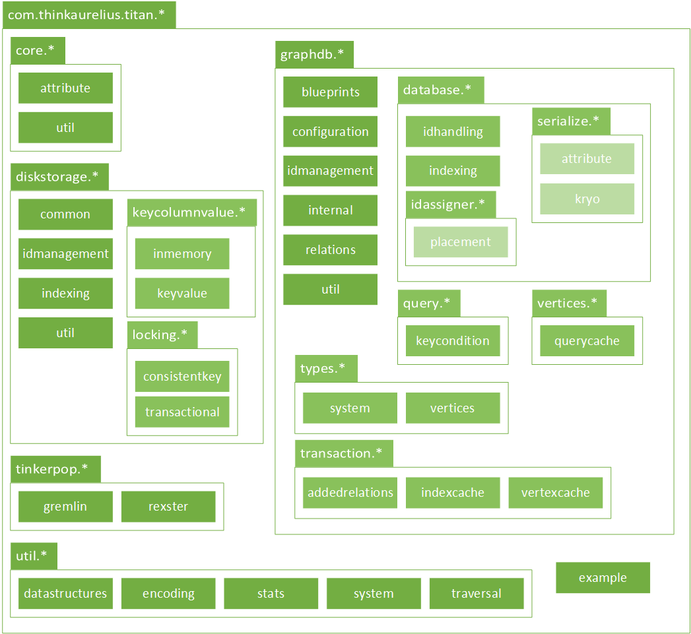
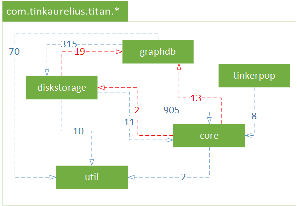

> **Note in advance**
>
> *In this document Aurelius Titan is described from a development viewpoint as described in Rozanski & Woods (2012). The dependency analysis is conducted using an Eclipse-based structure analysis tool for Java called [STAN]( http://stan4j.com/)*
>
> **Note on dependencies of Maven artifacts**
>
> *Actually in the Maven configuration files there are also dependencies set between titan-cassandra and titan-es, titan-hbase and titan-es, but they are not used, so can be left out. Furthermore the dependency between titan-berkeleyje and titan-es is only present because one test uses it which also seems redundant. [@PHameete](https://github.com/Phameete) made a [pull request](https://github.com/thinkaurelius/titan/pull/295) for this issue.*

# Development Viewpoint 

The software development process is supported by a development environment. In this viewpoint an attempt is made to provide insight in this environment. Things to think about include code structure and dependencies, build and configuration management, system-wide design constraints and standards.

## Maven Artifacts

Maven is used to build Titan in different configurations. The available Maven artifacts are described below stating their last version and popularity. More information on how to build Titan can be found in the [Developer Guide](devguide/BuildingTitan.md). The popularity indicates the percentage an artifact is downloaded compared to the others from the [MVN Repository](http://mvnrepository.com/artifact/com.thinkaurelius.titan).

| **Artifact** | **Last version** | **Popularity** | **Description** |
| :---------------- | :---------------- | :---------------- | :---------------- |
| titan-core | 0.3.1 |  | Core library |
| titan-test | 0.3.1 |  | Test suite |
| titan-es | 0.3.1 |  | Adapter for distributed indexing support via Elastic Search |
| titan-hbase | 0.3.1 |  | Adapter for distributed graph database HBase |
| titan-cassandra | 0.3.1 |  | Adapter for distributed graph database Cassandra |
| titan-berkeleyje | 0.3.1 |  | Adapter for local graph database BerkeleyDB |
| titan | 0.3.1 |  | Command line scripts for running and building Titan |
| titan-lucene | 0.3.1 |  | Adapter for (local) indexing support via Lucene |
| titan-all | 0.3.1 |  | Complete Titan distribution |
*Last update: June 9, 2013 - Source: [MVN Repository](http://mvnrepository.com/artifact/com.thinkaurelius.titan)*

The Maven artifacts `titan-es`, `titan-hbase`, `titan-cassandra`, `titan-berkeleyje` and `titan-lucene` are constructed using the [adapter pattern](http://en.wikipedia.org/wiki/Adapter_pattern) (or a so called wrapper) as a design pattern. These adapters provide an interface for the concerning technologies (Elastic Search, Lucene, HBase, Cassandra, BerkeleydDB) by which Titan is able to work with these technologies. 

Some of the Maven artifacts depend on each other. The dependencies between the different Maven artifacts are depicted in the figure below.


Also the `titan-core` artifact depends on different external artifacts. They are enumerated below. These dependencies are defined in the `pom.xml` file that Maven uses to automatically download these dependencies and incluse them in the build.

| **Group** | **Artifact** | **Version** |
| :---- | :---- | :---- |
| com.carrotsearch | hppc | 0.4.2 |
| com.esotericsoftware.kryo | kryo | 2.21 |
| com.google.code.findbugs | jsr305 | 1.3.9 |
| com.google.guava | guava | 13.0.1 |
| com.spatial4j | spatial4j | 0.3 |
| com.tinkerpop.blueprints | blueprints-core | 2.3.0 |
| com.tinkerpop.gremlin | gremlin-groovy | 2.3.0 |
| com.tinkerpop.rexster | rexster-core | 2.3.0 |
| com.tinkerpop.rexster | rexster-server | 2.3.0 |
| com.tinkerpop | frames | 2.3.0 |
| commons-codec | commons-codec | 1.7 |
| commons-collections | commons-collections | 3.2.1 |
| commons-configuration| commons-configuration | 1.6 |
| commons-io | commons-io | 2.0.1 |
| log4j | log4j | 1.2.16 |
| org.slf4j | slf4j-api | 1.6.1 |
| org.slf4j | slf4j-log4j12 | 1.6.1 |

## Organization of Code into Packages

The `titan-core` Maven artifact is made up of different packages. The main packages are preceded by `com.thinkaurelius.titan.*`. The main packages are `core`, `graphdb`, `diskstorage`, `tinkerpop`, `util` and `example`. The division of the code into packages and sub-packages is depicted in the figure below.



The dependencies between the main packages gives insight in the role the package play in the whole system. The arrow indicates a dependency and the arrow the magnitude of the dependency. The arrow in red indicate a [circulair dependency](https://en.wikipedia.org/wiki/Circular_dependency). There are several disadvantages to circulair dependencies and for the reason one of the [recommendations](Recommendations.md) is aimed at improving this.



## Common Processing

Some aspects of the whole system are present in every package. In Titan for configuration and logging the same methodologies are used throughout the system. Below these areas of common processing are further explained.

### Configuration

Configuration is handled via the `org.apache.commons.configuration` configuration package. This configuration is set during runtime and Titan handles the creation of the right classes. A configuration can be set in the code or alternatively be configured in a separate properties file. Some configuration options should **never** be modified once the graph database is initialized. Doing so may corrupt the graph or lead to unexpected behavior. The Titan wiki page [Graph Configuration](https://github.com/thinkaurelius/titan/wiki/Graph-Configuration) has extensive documentation about the different configuration options. A recommended read if you want to go in detail.


### Logging

Logging is implemented using the [SL4J](http://www.slf4j.org/) facade for the logging framework [log4j](http://logging.apache.org/log4j/1.2/). Setting it up in this way by using SL4J, the logging framework can be easily replaced by various other logging frameworks (like java.util.logging and logback) that are also compatible with SL4J. 

All log levels (`ERROR` > `WARN` > `INFO` > `DEBUG` > `TRACE`) are used throughout the code. Logging is used in the following packages:

* `com.thinkaurelius.titan.core.attribute`
* `com.thinkaurelius.titan.diskstorage` (`common` / `iddmanagement` / `keycolumnvalue` / `keycolumnvalue.keyvalue` / `locking.consistentkey` / `util`)
* `com.thinkaurelius.titan.graphdb` (`blueprints` / `configuration` / `database` / `database.idassigner` / `database.idassigner.placement` / `query` / `transaction` / `vertices.querycache`)
* `com.thinkaurelius.titan.tinkerpop.rexster`
* `com.thinkaurelius.titan.util.system`

One of the [recommendations](Recommendations.md) is to make some guidelines for logging, because several inconsistencies were found throughout the code on where it is used and where not. Besides the debug and trace levels are not always preceded by an `if()` statement. We recommend to do this in order not to waste resources on writing things to the log that are not displayed. See below for an example with relation to debugging log statements.

```java
if (log.isDebugEnabled()) log.debug("Hello World");
```

## Testing

The tests for Titan are located in the `titan-test` Maven artifact. There are unit tests for correctness (e.g. check whether a return value equals a certain value). On top of the unit tests there are several integration tests for important interfaces that can be extended when for instance a new backend is added and needs to be tested. Besides these tests there is also a performance test which extends the com.tinkerpop.blueprints.TestSuite class that checks whether performance hasn't decreased. More information about testing can be found in the [Developer Guide](devguide/DevelopingTitan.md#testing).

## Codeline Organization

In order to manage all the source code [a repository on Github](https://github.com/thinkaurelius/titan) is used. This repository is connected to an [MVN Repository](http://mvnrepository.com/artifact/com.thinkaurelius.titan) wich is used by [Maven](http://maven.apache.org/) to build the project.

For [continuous integration](http://en.wikipedia.org/wiki/Continuous_integration) [Travis CI](https://travis-ci.org/) is used. Once a pull request on Github is opened (for the master branch) Travis CI will retrieve the source code from Github, build Titan and run all tests in order to see if nothing is broken. In this way is made sure the master can always be deployed to users. The settings for Travis CI are specified in the `.travis.yml` file.
