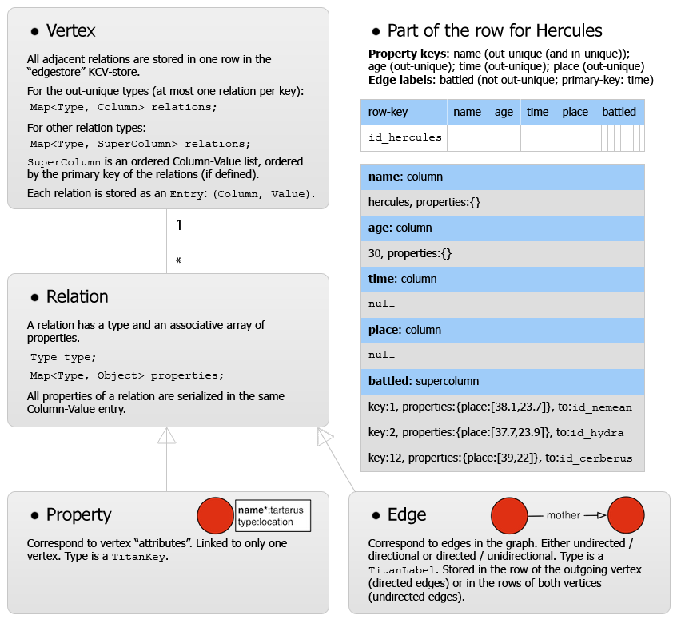

# The mapping from Property Graph Model to Key-Column-Value stores and External Indexes

## High-level overview

All data in the property graph are persisted to Key-Column-Value (KCV) stores and External Indexes.
Key-Column-Value (KCV) stores are an extension of key-value stores (associative dictionaries):
in KCV stores, each key maps to a **row** containing **entries**. Basically, each entry consists of an offset and a value.
By the design of Titan's backend, any KCV storage backend can be used after
the necessary interface code is implemented.
Plain Key-Value storage backends can also be used, although one must implement an adapter then (this is done for BerkeleyDB).
Titan persists to four KCV stores that work as follows:
* ``edgestore``. In this table, all relations (vertex properties and edges) are stored in a vertex centric manner.
This table contains a row for each vertex with a column-value entry for each relation this vertex participates in.
Used for local graph queries (a.k.a. vertex centric queries). For types in which a vertex can have multiple relations of the type, a <i>super-column</i> exists in the row in which all relations of the type are stored in sorted order according to a primary key (if defined).
* ``vertexindex`` and ``edgeindex``, the builtin indexes for vertex and edge properties, respectively.
Used for global graph queries.
These two indexes answer only very simple queries (exact match with one key); more complicated queries are handled by external indexes (Lucene or ElasticSearch).
For completeness, the structure of Titan's own ``vertexindex`` is: for each value of an indexed "root" property of
a vertex in the graph, a row is created in the KCV store ``vertexindex``, and for each property key a column-value pair exists in this row containing all vertex IDs that have this value as a property key.
Vertices having a property value multiple times with the same property key are listed multiple times.
The structure of Titan's ``edgeindex`` is similar, but then the properties are of edges instead of vertices.
* An ID store, ``titan_ids``. Actually this KCV store is used as a simple Key-Value store.
This table contains, for each <i>sub-partition</i>, a pointer to the next ID block to be used to assign IDs.
IDs always increase, IDs of removed vertices are not reused.
Partitions correspond to the nodes in a Cassandra/HBase cluster. For each partition, three subpartitions exist: vertices, relations and relationTypes.



The external indexes work as <i>document stores</i>: each vertex or edge is represented as a document consisting of all (key, value) attributes persisted to this index regarding this element.

## How relations are stored within a row
Each relation is stored by calculating an *offset* (a byte buffer, where the sequence of bytes is interpreted as the offset / address within the row)
and telling the KCV storage backend to store the serialized version of this relation at that offset within a row.
To prevent collisions in the offsets, Titan assigns the offsets sparsely.
The underlying backend also stores the rows in a sparse way which should be linear in the size of the entries.
Entries stored in the rows are always grouped by their type.

### Builtin indexes
The following two functions are used to calculate offsets / addresses for the builtin index stores.
For types where each value occurs only once, the offset corresponds to the type ID; for other types, the offset corresponds to (type ID, property ID).

```java
public class IndexSerializer {
    /* ... */
    private static final StaticBuffer getUniqueIndexColumn(TitanKey type) {
        return VariableLong.positiveByteBuffer(type.getID());
    }

    private static final StaticBuffer getIndexColumn(TitanKey type, long propertyID) {
        return VariableLong.positiveByteBuffer(new long[]{type.getID(), propertyID});
    }
}
```

### Edge store

For relations to be stored in the edge store, serialization happens in the ``EdgeSerializer`` class.
The procedure to calculate offsets / addresses is essentially the same,
except that now there is the additional constraint that for certain types, relations must be *ordered* according to a **primary key**.
Currently, after the type ID, <i>the byte sequence which forms the serialization of the primary key for a relation determines the offset within the row</i>.
Titan contains special serializer classes for some data types (for example, `LongSerializer`) for some datatypes to ensure that the generated byte sequences are compatible with the order on the datatype.
For example
However, this has been implemented only for <i>some</i> datatypes, such as `Integer` and `Long`, but not yet for `String` for example.

<b>Conclusion</b>: integer datatypes work well as primary key, but others don't.
