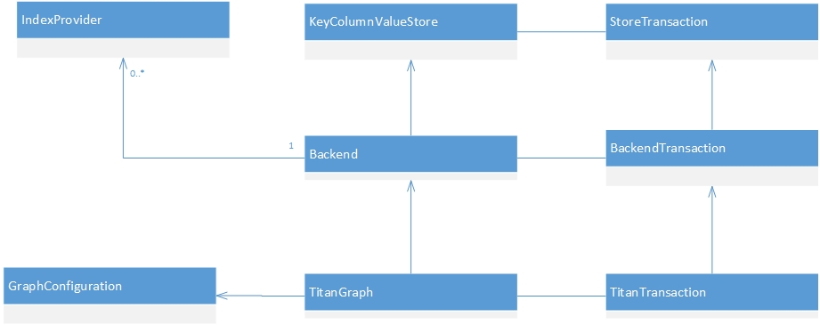
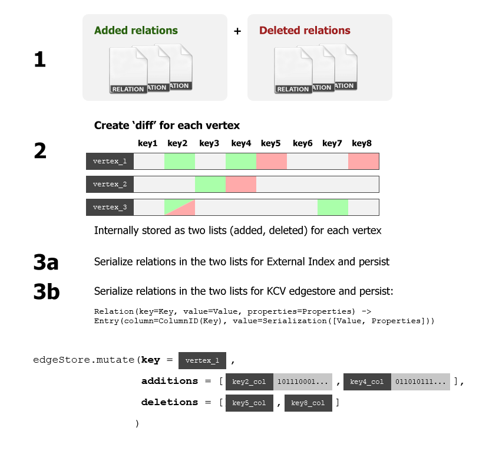
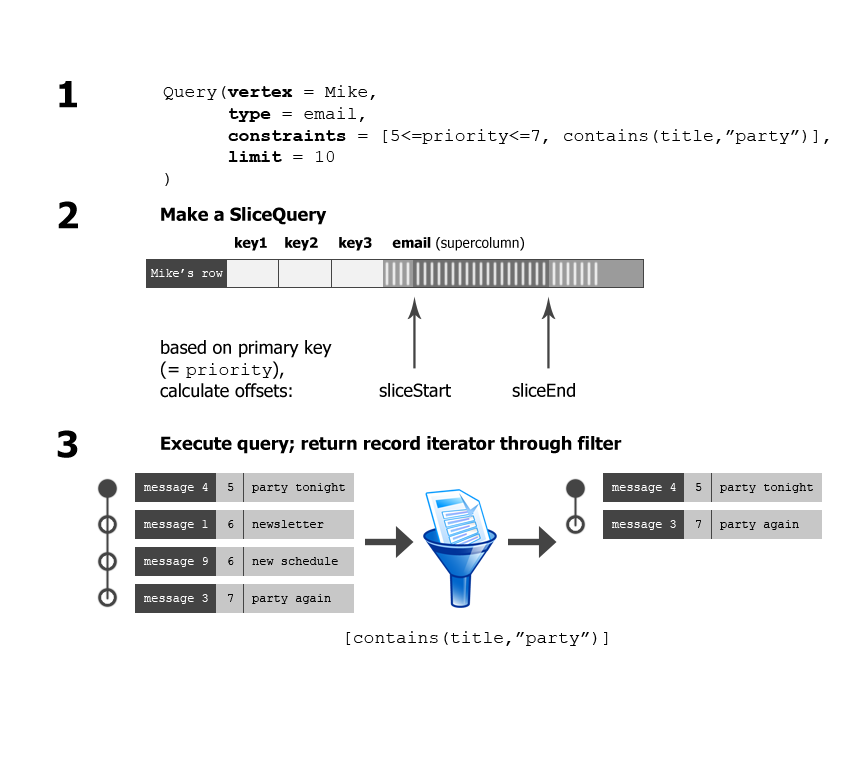

# Operations on the property graph
The different operations the user can execute are:
* Creating, updating and deleting: vertices, edges, properties of vertices,
properties of edges and properties of properties of vertices.
* Executing two fundamental (read) types of queries. The two possibilities are: <i>local</i> (a.k.a. vertex centric) queries and <i>global</i> queries.
<b>Note</b>: more complicated graph traversal queries are available through [Gremlin](https://github.com/tinkerpop/gremlin/wiki/). Gremlin answers these queries by repeatedly executing these fundamental queries on Titan.
    * A local query asks for a subset of the relations of a fixed vertex, for example all outgoing edges with label ``message-sent``, or the top-10 oldest friends of a certain person.
    * A global query asks for a subset of the vertices or edges of the graph meeting certain criteria.
For example, one can retrieve the ID of the unique vertex with ``name`` equal to "John Doe", or find all vertices in a graph of documents for which the property ``plaintext`` contains the word "lucene" (fulltext search).
* Maintaining the type collection (property key and edge label definitions). Typically, this does not happen very frequently.

## Creating, updating and deleting

Titan is a <b>transactional</b> database, which means that all operations executed on it have a transaction which they belong to.
Within a transaction, write operations in a transaction pile up, and the property graph is updated locally but these changes are not persisted.
A transaction ends when either <i>commit</i> or <i>rollback</i> is executed on it.
In the case of <i>commit</i>, all pending changes are persisted to the database.
Multiple clients can issue commits to the graph database which can result in inconsistencies (see [Doc:Concurrency](Concurrency.md)).
In the case of <i>rollback</i>, all pending changes are reverted locally.
In both cases, the transaction ends and a new transaction is started.

In the property graph model, creating, updating and deleting can be either of the following:
* Creating and deleting vertices (updating a vertex means updating its set of relations).
* Creating, updating and deleting relations of vertices, and creating, updating and deleting properties of these relations.
In Titan, relations are always persisted as a whole object (no update of only one property of a relation is possible, the whole object is persisted) so creating, updating and deleting properties
of a relation are technically equivalent to updating the relation itself.

We conclude that there are two types of operations: creating/deleting vertices, and creating/updating/deleting relations.

### Creating and deleting vertices
The following applies:
* Creating a vertex (initially, without any relations) consists of simply allocating a new (unique) vertex ID and returning it.
This vertex ID is then referred to in the vertex index when indexed properties are added, and it is the row ID of the vertex's adjacency list in the edge store.
There is one other implementation detail: one property, the builtin ``VertexState``, is set for the vertex. This is to ensure that the row of a vertex in the edge store is always non-empty, so that this row is included in the list of existing rows, used to iterate over all vertices in the graph.
* Deleting a vertex is a no-op, except for that all relations the vertex participates in must be removed first, including the ``VertexState`` relation, which leaves the row of the vertex in the edgestore empty, which is equivalent to the row not existing anymore.

### Creating, updating and deleting relations

The following applies:
* "Updating" a relation is implemented by deleting the old relation and creating the new relation.
* Upon creation or deletion of a relation, the local state of the property graph is updated, and the relation is also sent to
[``StandardTitanTx``](https://github.com/thinkaurelius/titan/blob/master/titan-core/src/main/java/com/thinkaurelius/titan/graphdb/transaction/StandardTitanTx.java)
which stores the change in a temporary list of relations.
``StandardTitanTx`` maintains two lists: one for added relations and one for deleted relations.

When <i>commit</i> is called, the relations are persisted to the indexes and to the edge store.
First, for each changed relation, the relation is added to the change lists for each vertex participating in the relation.
Then, the changes are persisted one vertex at a time. For each vertex:
* For the edge store: only the row of this vertex is manipulated. For all changed relations in which the vertex participates, the column within the row of this vertex is calculated in which the entry must be stored.
Also each added relation is serialized, so that we have a list of (Column, Value) pairs to be inserted and a list of Columns to be deleted. 
Then, a call to the edge store is done to mutate the row.
* For the indexes: this is done one relation at a time. For each relation, all indexes to which it must be persisted are mutated.

## Queries
Both types of queries find all records (either relations of a vertex, vertices in the whole graph or edges in the whole graph)
satisfying <i>constraints</i>. The supported constraints (class `graphdb.query.keycondition.Relation`) are:
* `Cmp`: Comparison constraints (==, !=, <, <=, >, >=, interval: "a <= x < b")
* `Geo`: Geographic shape constraints (intersect, disjoint, within)
* `Text`: Text constraints (contains, starts with)

### Executing vertex centric queries
For this type of query, the result is a subset of the relations of a fixed vertex.
There are many parameters, which can be configured using the ``VertexCentricQueryBuilder`` builder class:
* The fixed vertex.
* Allowed directions of matching relations w.r.t. this vertex.
* Allowed types of matching relation.
* The constraint set. Each constraint specifices that a certain property of a relation should satisfy some predicate.
* The maximum number of results to be returned.
* Whether only the matching properties, the matching edges or both should be returned.

The general procedure to execute a query is as follows:
* The ``VertexCentricQuery`` object is passed to the ``QueryProcessor<VertexCentricQuery, TitanRelation> edgeProcessor`` from the current transaction.
This processor should generate all matching records.
* The ``VertexCentricQuery`` object is passed to the ``EdgeSerializer`` class which generates a ``FittedSliceQuery`` for the query:
it tries to find a segment in the edge store row of this vertex as small as possible in which all matching records are contained.
The result of this procedure is a pair of byte buffers specifying begin and end of this segment.
* The calculated segment is traversed until enough matching records have been found or the end of the segment is reached.
The segment may or may not "fit", that is, it may or may not guarantee that all relations inside the segment are guaranteed to match.
If this is not guaranteed, matching is checked explicitly for each visited relation.

In the case the query has a comparison constraint w.r.t. the primary key of the type, then this traversal is executed very quickly because Titan precalculates the offsets.
For all other constraints, matching is calculated explicitly for many records.

### Executing global graph queries
For this type of query, the result is a subset of all vertices (or all edges) in the whole graph.
The parameters of a global graph query, besides the choice vertices/edges, which can be configured using the ``TitanGraphQueryBuilder`` builder class:
* The constraint formula. This could be more complicated than only a set (conjunction) of constraints, although this is not yet supported by the query evaluator.
So currently, this is a list of constraints like the vertex centric query.
* Which index to use.
* The maximum number of results to be returned.

If Titan's own index is used, the only possible query which does <i>not</i> require iterating over all vertices/edges and checking whether they satisfy the constraints, is <i>exact match of a single property</i>.
External indexes (currently, Lucene and ElasticSearch are supported) handle general queries.

The general procedure to execute a query is as follows:
* The ``StandardElementQuery`` object is passed to the ``QueryProcessor<VertexCentricQuery, TitanRelation> elementProcessor`` from the current transaction.
This processor should generate all matching records.
* The ``StandardElementQuery`` object is passed to the ``IndexSerializer`` class which calls an index to answer the query.
If the query consists of exactly one equality constraint, Titan's own index is used.
Otherwise, if no external index is configured to answer this query, Titan's own index is still used, although one must iterate over all vertices/edges and determine which match explicitly.
If an external index can be used:
    * The constraint set is translated to a constraint set on the serialized properties.
    * Through ``BackendTransaction#indexQuery``, ``IndexTransaction#query`` and finally an implementation of ``IndexProvider`` for the external index used, the external index is queried.

There are two types to distinguish: global graph queries (search for vertices or for edges matching a certain formula) and local graph queries (vertex centric queries).

## Maintaining the type collection
The set of type definitions is stored in a way similar to the vertices and edges themselves.
A type definition is stored as an ordinary vertex of the property graph, the properties of which are ``SystemKey`` objects, which are the following predefined types:
* ``PropertyKeyDefinition`` contains the serialized ``StandardKeyDefinition`` class defining the property key (if this definition is a property key def).
* ``RelationTypeDefinition`` contains the serialized ``StandardLabelDefinition`` class defining the edge label (if this definition is an edge label def).
* ``TypeName`` contains the string: the name of the type.
* ``TypeClass`` contains the enum value specifying whether this is a property key definition or an edge label definition.
* ``VertexState`` is used internally. The current use seems to be that it is the only property of all vertices (type vertices and vertices of the actual property graph) that is always present.
Since in the KCV store, the row of a certain ID exists exactly if it is not empty, this is used to have non-empty rows for all active vertices.

The type definition itself is stored in the edge store (one row containing all properties).
Furthermore, the ``TypeName`` and ``TypeClass`` properties are <b>indexed</b> through Titan's standard index.
This allows one to retrieve the type from its name through Titan's builtin vertex index, and to retrieve all defined types.
Maintaining the type collection thus proceeds in the same manner as maintaining ordinary vertices.
