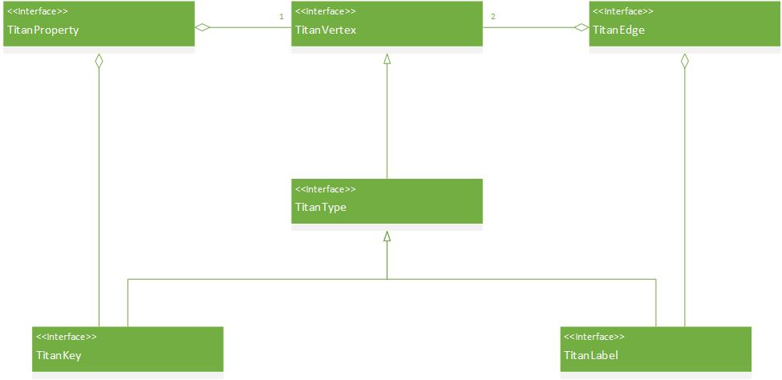
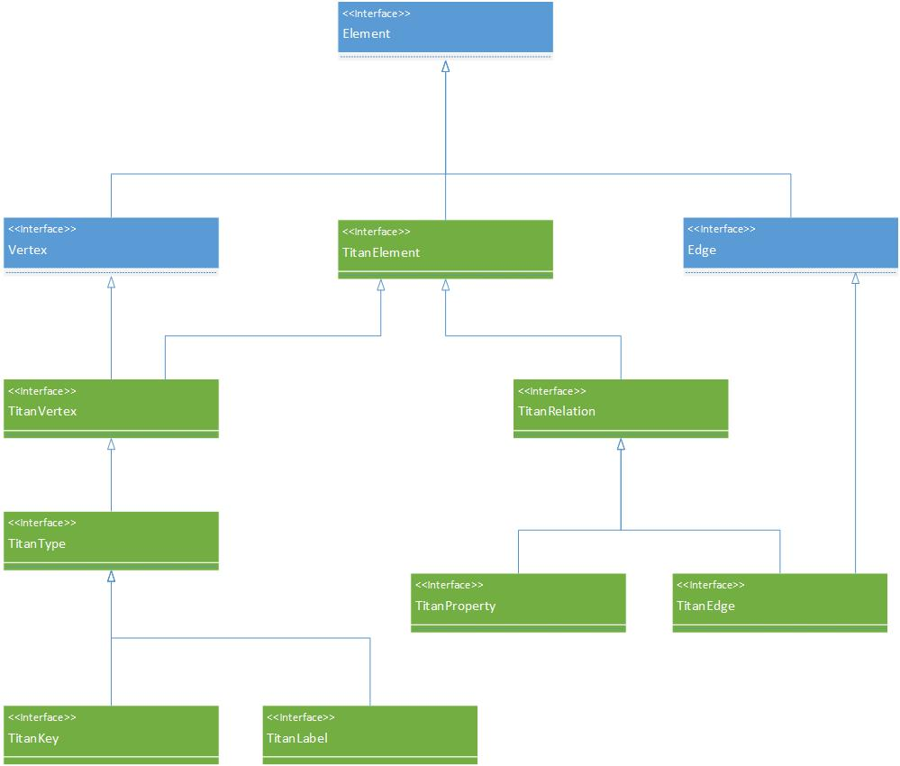

# The Property Graph Model in Titan

## The Blueprints interface
Basically, a graph consists of vertices and edges, which both have a set of properties ((key, value) pairs).
See the description at [Blueprints:Property-Graph-Model](https://github.com/tinkerpop/blueprints/wiki/Property-Graph-Model).
Example property graph taken from there:

## Titan's model

In Titan, the Blueprints type hierarchy is extended. At the base, there is the ``TitanElement`` interface
extending Blueprints' ``Element`` interface.
The ``TitanElement`` has two children: ``TitanVertex`` and ``TitanRelation``.
Here, a generalization was made: the properties of a vertex and the edges adjacent to it are all considered to be
<i>relations</i> in which the vertex participates.
The most important additional functionality provided by Titan's extended interface is:
* <i>Typing</i> of relations.
Plain strings as names (for properties) and labels (for edges) are now replaced by
property keys (``TitanKey``) and edge labels (``TitanLabel``) which define the <i>type</i> of the relation.
For a full description of types, see [Titan:Type-Definition-Overview](https://github.com/thinkaurelius/titan/wiki/Type-Definition-Overview).
* Two levels of properties. Vertices have relations as their properties ("root" properties), and relations have ordinary ("child") properties.
An edge is a relation and thus its properties are "child" properties. Vertices have properties which can have sub-properties.
* Support for multiple vertex properties with the same key. The properties of these properties distinguish them.

